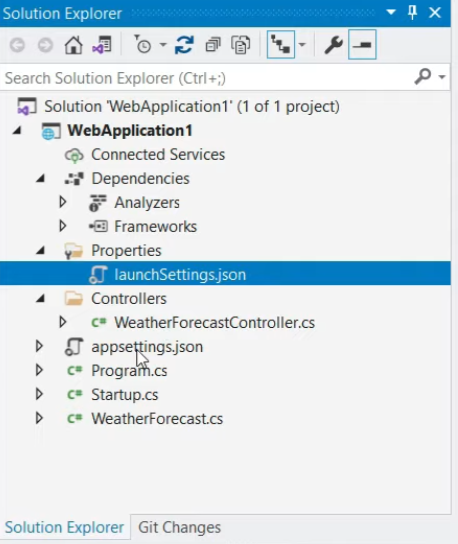

# .NET Web API Notes

## Common Files

#### Dependencies

* contains all dependencies of our project

### launchSettings.json

* contains details on how our project should be started

### Controllers

* contains the methods of our APIs

### appsettings.json

* generally keep configuration details, such as database details in appsettings

### Program.cs

* entry point of our app
* creates WebHost which helps the app listen to HTTP requests

### Startup.cs

* configures services for our app
  * services are basically components that can be used everywhere in our app through dependency injection
* also contains the **configure** method which creates our app's request processing pipeline